# Full Stack Web Development with Flask

**[LinkedIn Learning: Full Stack Web Development with Flask](https://www.linkedin.com/learning/full-stack-web-development-with-flask/)**

Stacks: `Flask`, `MongoDB`, `HTML`, `CSS`, `Bootstrap`

*`Notes taken during the course`*

---

## 1. Setting up the environment.
1. Create virtual environment. VENV already installed.
2. Create venv. Terminal: 
> py -m venv venv
3. Activate venv. Terminal: 
> venv\Scripts\activate
4. Install Flask. Terminal: 
> pip install flask 
5. Install Flask WTF. Terminal: 
> pip install flask-wtf
6. .flaskenv: FLASK_ENV=development, FLASK_APP=main.py
7. Install python-dotenv. Termianl: 
> pip install python-dotenv
8. Deactivate the environment. Termianal: 
> deactivate
9. Freeze requirements. Terminal:
> pip freeze > requirements.txt
10. Install requirements. Terminal:
> pip install -r requirements.txt
11. Run flask app. Terminal:
> flask run
12. __init__.py will be the initialization file. By default the app will look for this file to run it.
13. Creating a config.py module.
14. Creating a routes.py module for all routing patterns.
15. Modifying the __init__.py

---

## 2. Creating a Flask Project

### 2.1 Creating th enrollment application
### 2.2 Running and configuring the development server
### 2.3 Creating the homepage
1. Creating the template for the home (index.html).
2. Importing the render_template function
3. Using Jinja template expression
4. Using the include directive to include external files.

### 2.4 Creating navigation links and route patterns
1. Creating navigation menus
2. Using the url_for function to resolve links
3. Using the route() decorator to bind a function to one or more URL patterns
4. Jinja delimiters
5. Jinga if statement.
> url_for('index') returns the template for that function defined in route. Good practise to avoid defining it everywhere. 

---

## 3. Working with Templates

### 3.1 Creating the base template
1. The Jinja template inheritance logic
2. Creating the base template
3. Using template inheritance to create child templates
4. Passing data to the view using props
5. Accessing data via de the request and response objects
> {{ self.content() }} to render again a block

### 3.2 Creating child templates

### 3.3 Passing data to the view
1. Passing data from the source to the view
2. Highlighting the active menu item
3. Using For directive
4. Building the course table with JSON data
>    courseData = [{"courseID":"1111","title":"PHP 111","description":"Intro to PHP","credits":"3","term":"Fall, Spring"}, {"courseID":"2222","title":"Java 1","description":"Intro to Java Programming","credits":"4","term":"Spring"}, {"courseID":"3333","title":"Adv PHP 201","description":"Advanced PHP Programming","credits":"3","term":"Fall"}, {"courseID":"4444","title":"Angular 1","description":"Intro to Angular","credits":"3","term":"Fall, Spring"}, {"courseID":"5555","title":"Java 2","description":"Advanced Java Programming","credits":"4","term":"Fall"}]

### 3.4 Accesing data via request and response objects
1. URL variables
2. HTTP Methods (GET, POST)
3. The global objects: Request and Response
4. Requests and response are all JSON API format

### 3.5 URL Variables
1. Routing parameters
2. Creating a URL variable
3. Setting default data to a URL variable
4. Passing a URL variable to a template

### 3.6 Working with the GET method
1. Creating the enrollment form using GET method
2. Creating the enrollment template
3. Creating the enrollment route (URL pattern)
4. Accessing form data via the GET method

### 3.7 Working with the POST method
1. Updating the enrollment form using POST method
2. Adding the GET and POST methods to the route
3. Accessing form data using the form object

### 3.8 Sending a JSON response
1. The Response Object
2. Creating two APIs to send JSON response
> Everything that comes from the URL will always be a string \
> http://127.0.0.1:5000/api/ \
> Inspect + Network \
> 

---

## 4. Working with Databases

### 4.1 Installing database systems
1. Installing the MongoDB database system. [MongoDB Community Server](https://www.mongodb.com/try/download/community)
> mongodb://localhost:27017
2. Installing the MongoEngine extension for Flask
> pip list \
> pip install flask-mongoengine
3. Setting up the database
4. Connecting to the database
5. Creating documents and data
6. Creating the data model

### 4.2 Working with Databases
1. Setting up a MongoDB database
> MONGODB_SETTINGS = { 'db': 'UTA_Enrollment' }
2. Importing the MongoEngine
> From flask_mongoengine import MongoEngine
3. Initializing the database object
> db = MongoEngine() \
> db.init_app(app)

### 4.3 Connecting to the database
1. Connecting to the MongoDB via the MongoEngine object
2. Hooking up a user collection using a simple user model class
3. Inserting sample user document (data) to a collection
4. Displaying the collection to the view

### 4.4 Creating documents and data
1. Creating collections to store documents (data)
2. Inserting documents into our collections
3. Using MongoDB shell commands
> db.createCollection( `collection` ) \
> db.`collection`.insert( { ... } ) \
> db.`collection`.insertMany( { ... } )
4. Inserting JSON data using the mongoimport.exe via command line
> mongoimport --db `DB` -collection `collection` --file `file` \
> mongoimport -d `DB` -c `collection` --file `file`
https://www.mongodb.com/docs/database-tools/mongoimport/

### 4.5 Creating the data models
1. Creating the models module
2. Creating the **User** model
3. Creating the **Course** model
4. Creating the **Enrollment** model
> class ModelName(db.Document): \
>   field1 = db.IntField() \
>   field2 = db.StringField() \
>   ... \
>   fieldn = db.StringField()

---

## 5. Working with Web Forms and Flask-Security

### 5.1. Installation and configuration
1. Installing and configuring Flask-WTF (Web Template Form) amd Flask-Security extensions
2. Creating the login and registration pages
3. Processing form data and updating the database
4. Creation the courses and enrollment pages
5. Creating sessions and authentication

> pip install flask-wtf flask-security 

### 5.2. Creating the login and registration pages
1. Creating the login and registration pages
2. Creating form classes and updating the templates using WTForms librarie
3. Creating alert messages using the flash() method

### 5.3. Updating the login route and ogin template
1. Updating the login route to capture form data
2. Updating the login template using WTForms library

### 5.4. Flashing messages
1. Creating alert messages using the flash() method (source)
2. Retrieving flash messages suing the get_flashed_mesages() (view)

### 5.5. Displaying form validation error messages
1. Validating form data
2. Showing inline error messages fo form fields
3. Styling and formatting error messages

### 5.6. Processing form data and updating the database
1. Form data validation
2. Processing form data for database update
3. Hashing password using Werkzeug library (a WSGI web application library)
> `Hashing`: generate_password_hash('password') \
> `Unhashing`: check_password_hash(password, 'password')

### 5.7. Updating login route to interact with database
1. Form data validation
2. Validatin email addresses
3. Hashing password using Werkzeug library (a WSGI web application library)
> `Hashing`: generate_password_hash('password') \
> `Unhashing`: check_password_hash(password, 'password')

### 5.8. Updating registration route to interact with database
1. Validating form data
2. Hashing password using Werkzeug library (a WSGI web application library)
3. Inserting data into the database
4. Verifying data in the database using Compass interface

### 5.9. Creating the courses page
1. Querying course data from database
2. Populating the course template
> order_by + - ascending, descending respectively

### 5.10. Creating the enrollment page
1. Creating the course enrollment page
2. Course enrollment process
3. Performing join queries on multiple cllections using **$aggregate**
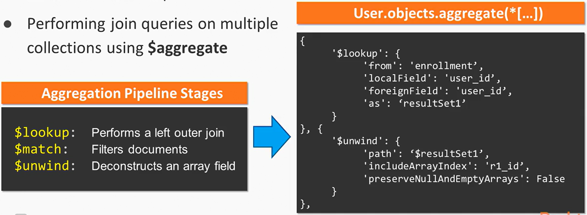

### 5.11. Updating the enrollment template
1. Updating the course enrollment function
2. Updating the enrollment template to show a list of courses

### 5.12. Creating the MongoDB aggregation pipeline
1. Exploring the MongoDB Aggregation framework using Compass interface
2. Creating the aggregation pipeline to process data in three stages
> $lookup: Performs a left outer join \
> $match: Filters documents \
> $unwind: Deconstructs an array field
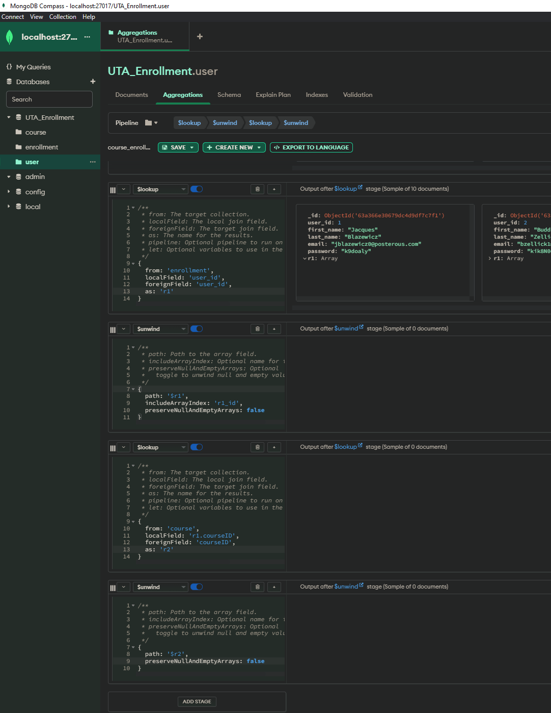
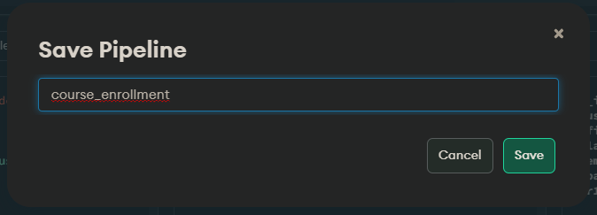
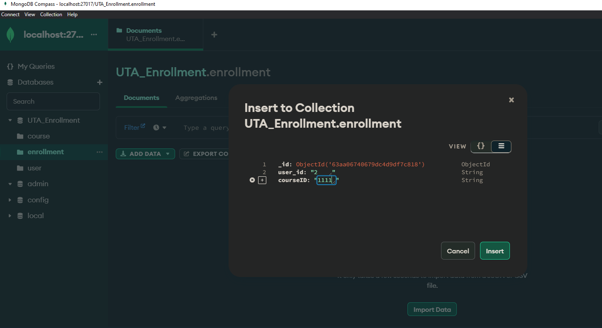
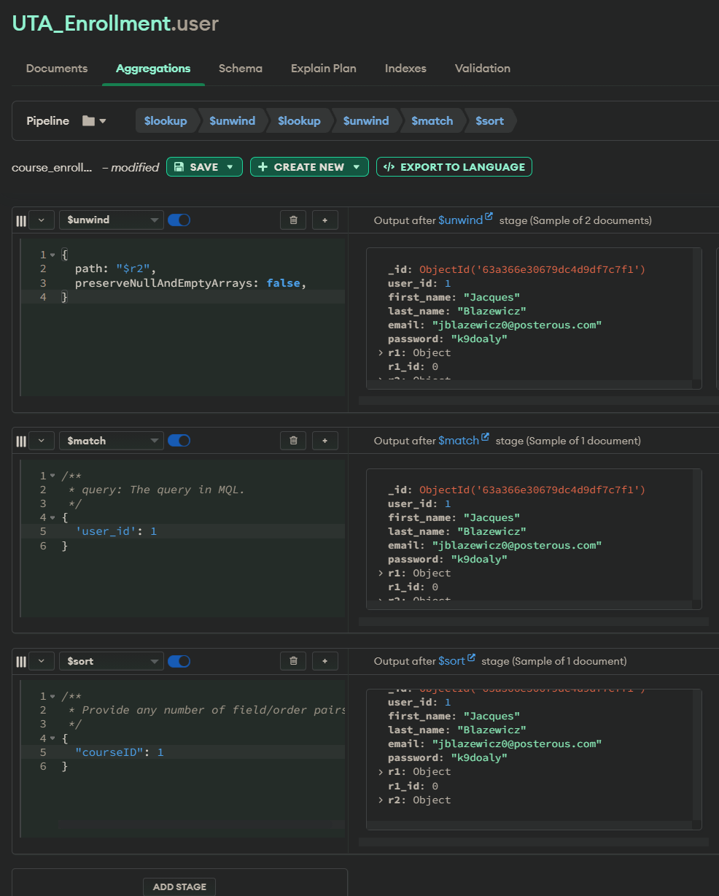
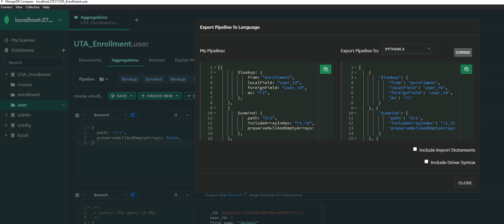

### 5.13. Adding the aggregation pipeline to application
1. Updating the enrollment route to interact with the database
2. Integrating the aggregation pipeline into the application

### 5.14. Creating sessions and authentication
1. State management and user authentication using Flask-Session
2. The session object stores information specific to a  user
3. Implementation on top of cookies and signs cookies cryptographically
4. Easy to use and implement
> https://flask-login.readthedocs.io/en/latest/ \
> Generate key: py -c "import os; print(os.urandom(16))"

### 5.15. Setting up the session for the logout an denrollment routes
1. Creating the Logout route
2. Setting up sessions and Enrollment routes

### 5.16. Updating the navigation and testing the session
1. Configuring the navigation to use sessions
2. Testing the sessions

### 5.17. Adding the welcome message to layout
1. Adding a welcome user messages to the layout
2. Modifying the stylesheet to format the welcome message
3. Testing the layout

---

## 6. Creating and Testing REST APIs Using Postman

### 6.1. Installing Postman and the Flask-RESTPlust APIs extension
1. Creating REST APIs
2. Installing Flask-RESTPlus extension
3. Installing and using Postman for testing our APIs
4. Creating and testing REST API CRUD operations using HTTP verbs
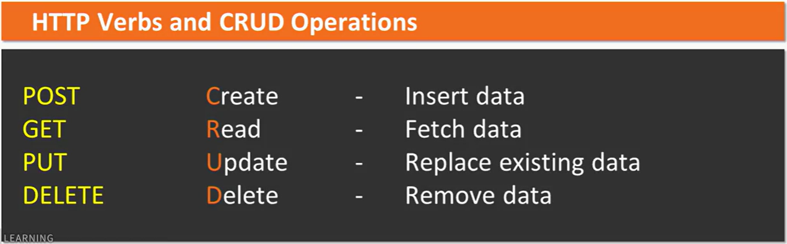

`Flask-RESTPlus Extension`
* Flask extension that adds support for creating REST APIs
* Works with Python 2.7+ or higher and JIT compilers PyPy and PyPy3
* Very minimal setup
* Provides a coherent collection of decorators and tools to describe APIs
* Decorate classes and methods
* Multiple endpoints are allowed in the route() decorator
* Built-in support for request data validation
> pip install flask-restplus

`Postman` \
*Postman is an API platform for developers to design, build, test and iterate their APIs. As of April 2022, Postman reports having more than 20 million registered users and 75,000 open APIs, which it says constitutes the world's largest public API hub. [Wikipedia](https://en.wikipedia.org/wiki/Postman_(software))*
* API development environment for testing APIs
* Chrome's HTTP client
* Most-used REST client worldwide
* Automate testing with Collection runner
* API Monitoring
* [Free Download](https://www.getpostman.com)

### 6.2. Fetching data using **GET**
1. Creating the API to handle GET requests
2. GET is one of the HTTP verbs used for REST API CRUD operations
> pip install flask-restx \
`flask-restplus is dead, so replaced by flask-restx` \
[Stackoverflow Post](https://stackoverflow.com/questions/60156202/flask-app-wont-launch-importerror-cannot-import-name-cached-property-from-w)
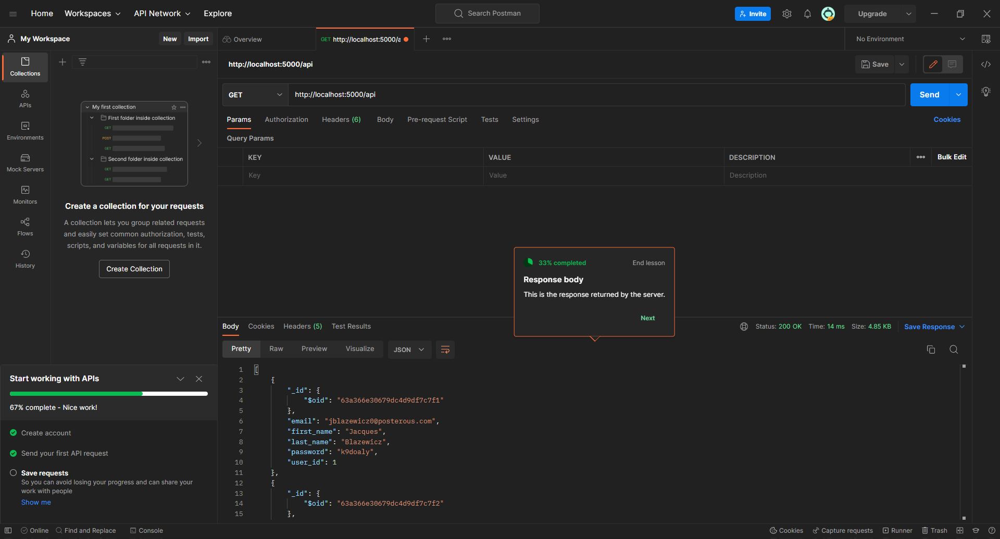

*What is a **Payload** in an API? The payload of an API is the data you are interested in transporting to the server when you make an API request. Simply put, it is the body of your HTTP request and response message*

### 6.3. Inserting data using **POST**
1. Creating the API to handle POST requests
2. How POST is one of HTTP verbs used for REST API CRUD operations
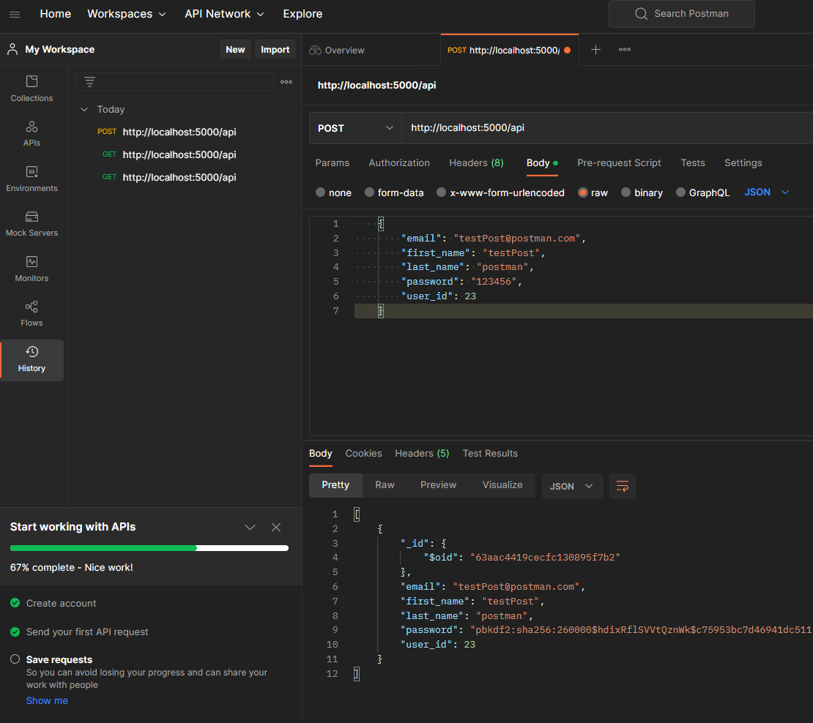

### 6.4. Updating data using **PUT**
1. Creating the API to handle PUT requests
2. How PUT is one of HTTP verbs used for REST API CRUD operations
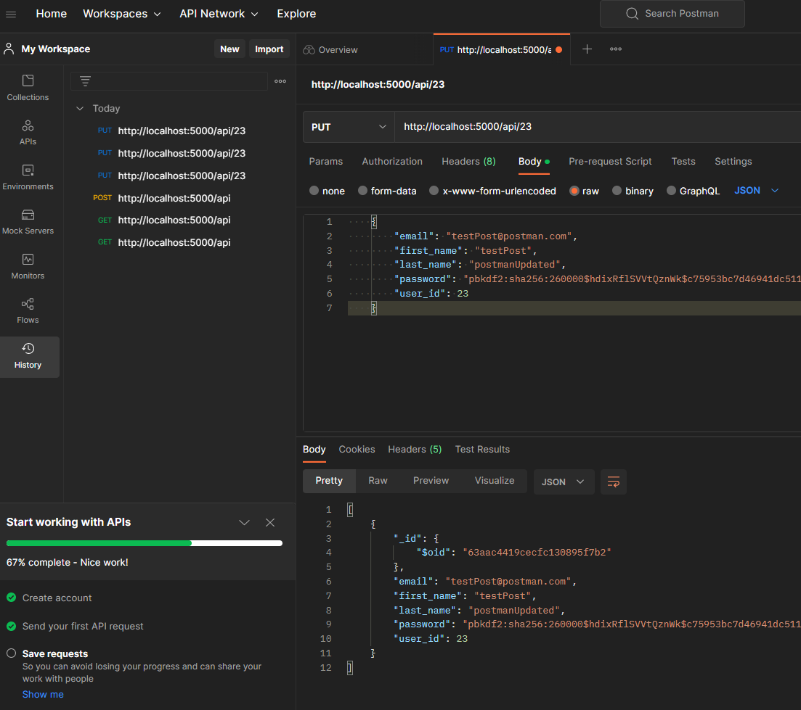

### 6.5. Deleting data using **DELETE**
1. Creating the API to handle DELETE requests
2. How DELETE is one of HTTP verbs used for REST API CRUD operations
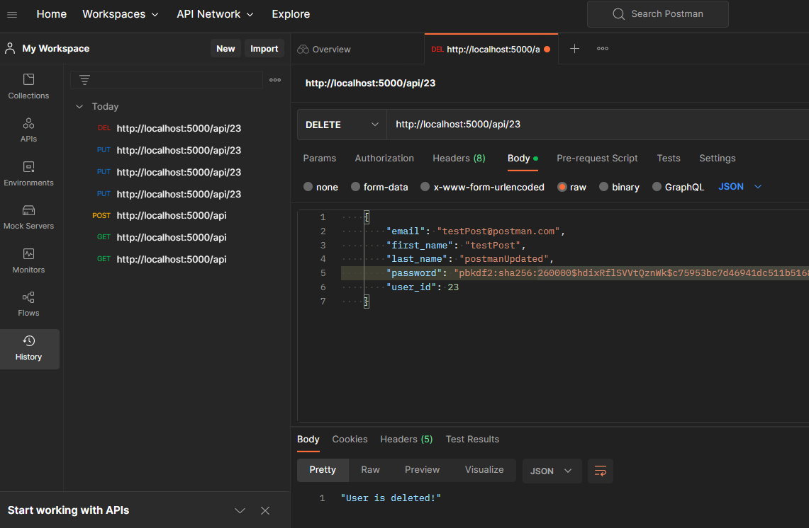

 
 

---
## Useful Links
- [Markdown Cheatsheet](https://github.com/adam-p/markdown-here/wiki/Markdown-Cheatsheet)
- [Course GitHub from Christian Hur](https://github.com/ChristianHur/Full-Stack-Web-Development-with-Flask-Video-)
- Shortcut to preview .md file in Visual Studio Code: Cntrl+Shift+V
